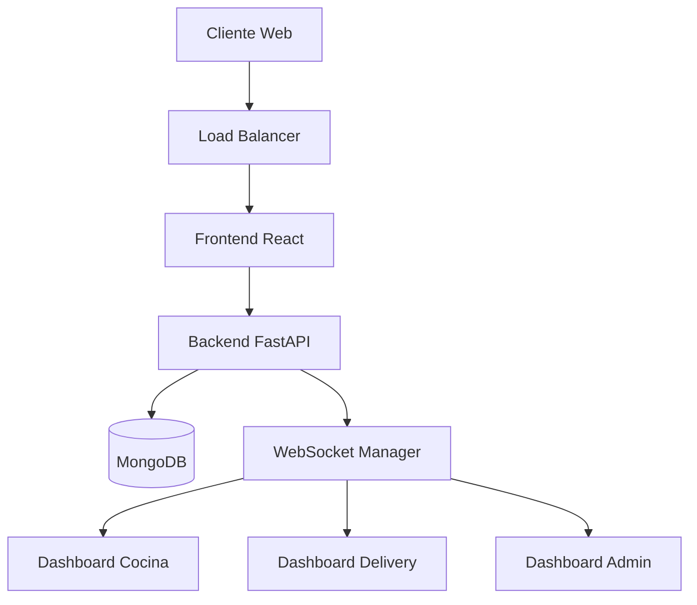
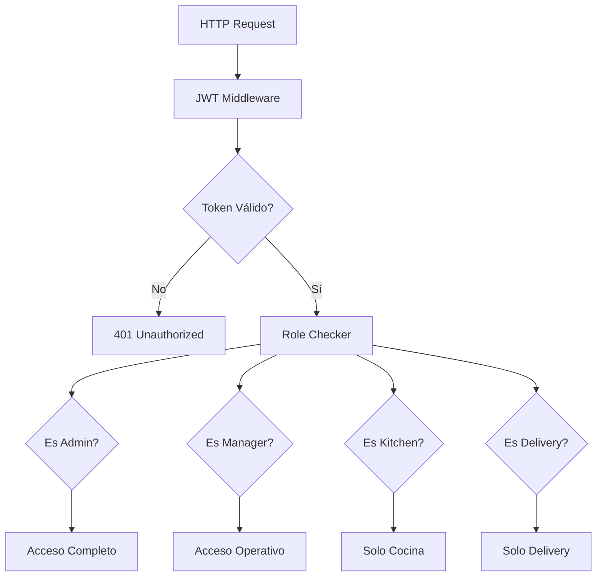
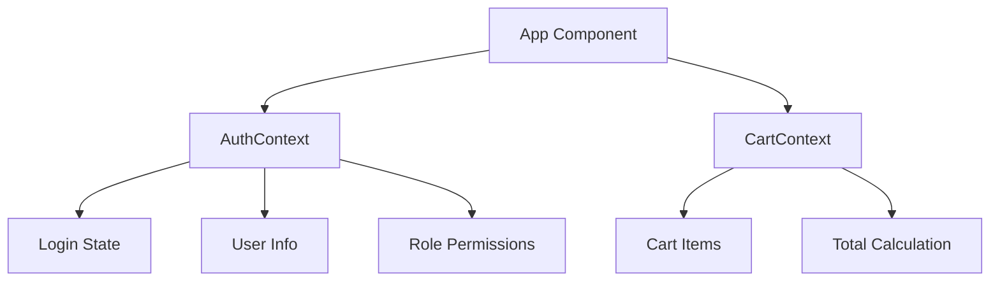
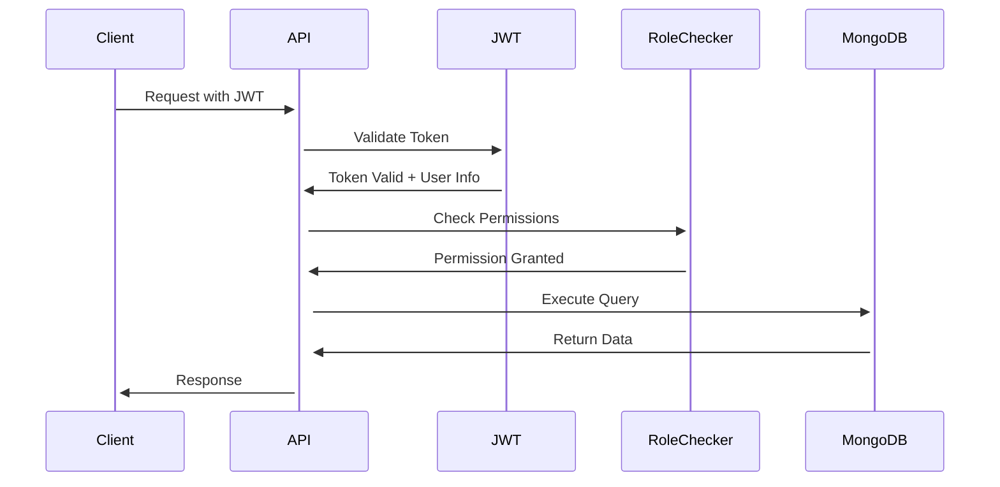

# Arquitectura de PizzApp

## 📋 Resumen General

PizzApp es una aplicación web moderna construida con una **arquitectura de microservicios ligera**, separando claramente el backend (API) del frontend (SPA). Está diseñada para escalabilidad, mantenibilidad y facilidad de desarrollo.

## 🏗️ Arquitectura de Alto Nivel



## 🔧 Componentes Principales

### 1. Frontend (React SPA)
**Ubicación**: `/frontend/`
**Responsabilidades**:
- Interfaz de usuario moderna y responsive
- Gestión de estado del carrito de compras
- Autenticación y autorización del lado cliente
- Routing y navegación
- Comunicación con el backend via HTTP

**Tecnologías**:
- React 19 con hooks
- React Router para navegación
- Tailwind CSS para estilos
- Axios para HTTP requests
- Context API para estado global

### 2. Backend API (FastAPI)
**Ubicación**: `/backend/server.py`
**Responsabilidades**:
- API RESTful para todas las operaciones
- Autenticación JWT
- Autorización basada en roles
- Lógica de negocio
- Validación de datos
- Gestión de WebSockets

**Tecnologías**:
- FastAPI (framework asíncrono)
- Pydantic para validación
- JWT para autenticación
- Bcrypt para hashing de passwords
- WebSockets para tiempo real

### 3. Base de Datos (MongoDB)
**Responsabilidades**:
- Persistencia de datos
- Almacenamiento de usuarios, pedidos, menú
- Índices para optimización de consultas
- Agregaciones para analytics

**Colecciones**:
- `admin_users` - Usuarios del sistema
- `menu_items` - Productos del menú
- `orders` - Pedidos de clientes
- `delivery_persons` - Repartidores

### 4. WebSocket Manager
**Responsabilidades**:
- Comunicación en tiempo real
- Notificaciones push
- Actualizaciones de estado
- Sincronización entre dashboards

## 🔄 Flujo de Datos

### 1. Autenticación
```
Cliente → POST /api/auth/login → Validación → JWT Token → Cliente
```

### 2. Creación de Pedido
```
Cliente → Menú → Carrito → Checkout → POST /api/orders → 
MongoDB → WebSocket → Dashboards Admin/Kitchen
```

### 3. Gestión de Pedido
```
Kitchen Dashboard → PUT /api/orders/{id}/status → MongoDB → 
WebSocket → Todos los Dashboards + Cliente
```

## 🎭 Sistema de Roles y Permisos

### Arquitectura de Autorización



### Matriz de Permisos

| Endpoint | Admin | Manager | Kitchen | Delivery |
|----------|-------|---------|---------|----------|
| GET /api/menu | ✅ | ✅ | ❌ | ❌ |
| POST /api/menu | ✅ | ✅ | ❌ | ❌ |
| GET /api/orders | ✅ (all) | ✅ (all) | ✅ (kitchen) | ✅ (delivery) |
| PUT /api/orders/status | ✅ (all) | ✅ (all) | ✅ (limited) | ✅ (limited) |
| GET /api/analytics | ✅ | ✅ | ❌ | ❌ |
| GET /api/users | ✅ | ❌ | ❌ | ❌ |

## 📊 Gestión de Estado

### Frontend State Management



**Contextos Utilizados**:
- **AuthContext**: Gestión de autenticación y usuario actual
- **CartContext**: Estado del carrito de compras

### Backend State Management

**Stateless Design**: El backend es completamente stateless, toda la información se persiste en MongoDB.

**WebSocket Connections**: Mantenidas en memoria para comunicación en tiempo real.

## 🔌 Integraciones Externas

### Actuales
- **MongoDB**: Base de datos principal
- **Unsplash**: Imágenes de productos (URLs estáticas)

### Futuras (Roadmap)
- **Twilio**: Notificaciones WhatsApp
- **Stripe/MercadoPago**: Pagos en línea
- **Google Maps**: Geolocalización y rutas

## 📈 Escalabilidad

### Horizontal Scaling
- **Frontend**: Puede ser servido desde CDN
- **Backend**: Múltiples instancias detrás de load balancer
- **MongoDB**: Replica sets y sharding

### Vertical Scaling
- **Aumentar CPU/RAM** según demanda
- **Optimización de consultas** MongoDB
- **Caching** con Redis (futuro)

## 🔒 Seguridad

### Capas de Seguridad

1. **Autenticación**: JWT tokens con expiración
2. **Autorización**: Role-based access control
3. **Validación**: Pydantic schemas en todos los inputs
4. **Hashing**: Bcrypt para passwords
5. **CORS**: Configurado para orígenes específicos
6. **HTTPS**: Recomendado en producción

### Flujo de Seguridad



## 🚀 Deployment Architecture

### Desarrollo
```
localhost:3000 (React) ↔ localhost:8001 (FastAPI) ↔ localhost:27017 (MongoDB)
```

### Producción Recomendada
```
CDN (React) ↔ Load Balancer ↔ FastAPI Instances ↔ MongoDB Cluster
```

## 📊 Monitoreo y Observabilidad

### Logs
- **FastAPI**: Logging configurado con nivel INFO
- **MongoDB**: Query logs para debugging
- **React**: Console logs para desarrollo

### Métricas (Futuro)
- **Prometheus**: Métricas de aplicación
- **Grafana**: Dashboards de monitoreo
- **Health checks**: Endpoints de salud

## 🔄 Patrones de Diseño Utilizados

### Backend
- **Repository Pattern**: Separación de lógica de datos
- **Dependency Injection**: FastAPI dependencies
- **Factory Pattern**: Creación de tokens JWT
- **Observer Pattern**: WebSocket notifications

### Frontend
- **Component Pattern**: Componentes reutilizables
- **Context Pattern**: Estado compartido
- **Higher-Order Components**: ProtectedRoute
- **Render Props**: Conditional rendering por roles

## 📝 Convenciones de Código

### Backend (Python)
- **PEP 8**: Estilo de código Python
- **Type Hints**: Tipado completo
- **Docstrings**: Documentación de funciones
- **Async/Await**: Código asíncrono

### Frontend (JavaScript)
- **ES6+**: Sintaxis moderna
- **JSDoc**: Documentación de funciones
- **Component First**: Arquitectura basada en componentes
- **Hooks**: React Hooks para estado

## 🔧 Herramientas de Desarrollo

### Backend
- **FastAPI**: Framework web
- **Uvicorn**: Servidor ASGI
- **Pydantic**: Validación de datos
- **Motor**: Driver MongoDB asíncrono

### Frontend
- **Create React App**: Boilerplate
- **Craco**: Configuración personalizada
- **Tailwind CSS**: Framework CSS
- **ESLint**: Linting de código

### Base de Datos
- **MongoDB Compass**: GUI para desarrollo
- **MongoDB Atlas**: Cloud hosting

---

Esta arquitectura está diseñada para ser **escalable**, **mantenible** y **fácil de entender**, proporcionando una base sólida para el crecimiento futuro de PizzApp.